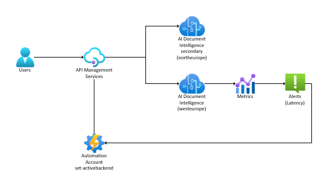

# Azure AI Document Intelligence resiliency with Azure API Management demo

Azure Document Intelligence testing and demo project for analyzing invoices using both SDK and REST API approaches, with backend switching capabilities via Azure API Management. 

Useful to add resiliency and failover between multiple Azure regions when using Azure AI Document Intelligence.

In a **production scenario**, you would configure an alert on your primary region Document Intelligence resource to trigger a function, logic app or automation runbook that would update the APIM named value to switch to the secondary region in case of failures. 



## Improvements not considered in this demo

- Private endpoints for Azure AI Document Intelligence resources
- Managed identities for authentication instead of API keys

## Azure Setup

Before running this project, ensure you have set up:

- An Azure AI Document Intelligence resource in a region (eg: westeurope)
- An Azure AI Document Intelligence resource in another region (eg: northeurope)
- An Azure API Management (APIM) service
- An Azure API Management backend pool with both Document Intelligence resources added as backends
- An Azure API Management named value to store the active backend ID (eg: doc-north or doc-west)

You can find the api definition in `doc-api.json` (replace YOUR-SERVICE-NAME with your actual service name).

In Azure API Management, configure the following:

- An API called Azure AI Document Intelligence
- Add an operation for the `analyze` endpoint (POST to /documentintelligence/documentModels/{modelId}:analyze?api-version={api-version})
- Add an operation for the `analyzeResults` endpoint (GET to /documentintelligence/documentModels/{modelId}/analyzeResults/{resultId}?api-version=2024-11-30-preview)

Once these API endpoints are created, apply the provided policies from `policy-analyze-doc.xml` (applied to the `analyze` operation) and `policy-api.xml` (applied to the entire API) to ensure proper routing and header manipulation.

## Why is this needed?

Because AI Document Intelligence injects the Operation-Location header when calling the analyze_document endpoint, we need to ensure that this header:

- Points to API Management instead of the direct AI Document Intelligence endpoint
- Injects the backendId query parameter to route requests to the correct backend, or else the polling will fail.


## Overview

This project provides tools to test Azure Document Intelligence's prebuilt invoice analysis model. It includes:

- **SDK implementation** (`run-sdk.py`) - Azure Document Intelligence Python SDK with LRO poller
- **Backend switching script** (`script-switch-backend.sh`) - Toggle between different Azure backends

## Prerequisites

- Python 3.7+
- Azure CLI (for backend switching script)

## Setup

1. **Clone the repository**
   ```bash
   git clone https://github.com/mooncowboy/docintel.git
   cd docintel
   ```

2. **Create a virtual environment**
   ```bash
   python -m venv .venv
   source .venv/bin/activate  # On Windows: .venv\Scripts\activate
   ```

3. **Install dependencies**
   ```bash
   pip install -r requirements.txt
   ```

4. **Configure environment variables**
   
   Copy the sample environment file:
   ```bash
   cp .env.sample .env
   ```
   
   Edit `.env` and add your credentials:
   ```
   AZURE_DI_ENDPOINT="https://<service_name>.azure-api.net/doc/"
   AZURE_DI_KEY="<apim_service_key>"
   APIM_SERVICE_NAME="<service_name>"
   ```

5. **(Optional) Add PDF files**
   
   There are 2 sample documents included. If you want to use your own, place your invoice PDF files in the `docs/` directory.

## Usage

### Analyze Documents with SDK

Use `run-sdk.py` for SDK-based analysis:

```bash
python run-sdk.py <pdf_file_name> <number_of_runs>
```

Example:
```bash
python run-sdk.py small.pdf 1
```

This script:
- Uses the Azure Document Intelligence Python SDK
- Demonstrates LRO (Long Running Operation) poller behavior
- Includes a 1-minute delay to test backend switching during analysis

### Switch Backend Endpoints

Use the bash script to toggle between different Azure backends **while the analysis is running** so the endpoint is changed during polling:

```bash
sh script-switch-backend.sh
```

This script:
- Retrieves the current active backend (`doc-north` or `doc-west`)
- Toggles to the other backend
- Updates the APIM named value

## Project Structure

```
docintel/
├── docs/                     # PDF files for analysis
├── run-sdk.py                # SDK implementation
├── script-switch-backend.sh  # Backend switching utility
├── requirements.txt          # Python dependencies
├── .env.sample               # Environment variables template
├── docapi.yaml               # API configuration
├── policy-analyze-doc.xml    # APIM policy for document analysis
└── policy-api.xml            # APIM policy configuration
```

